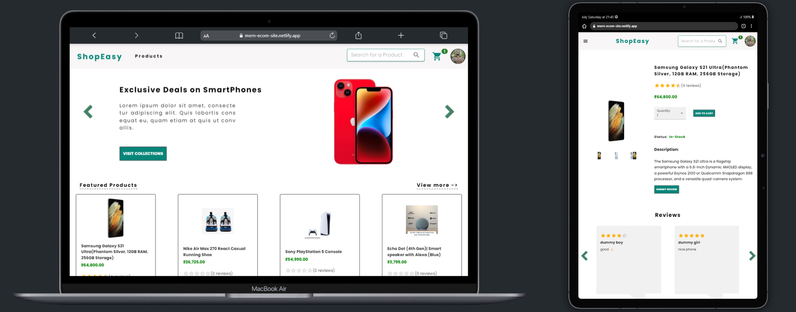
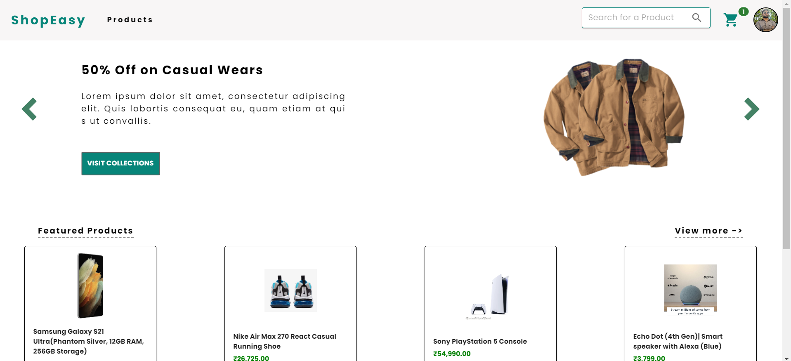
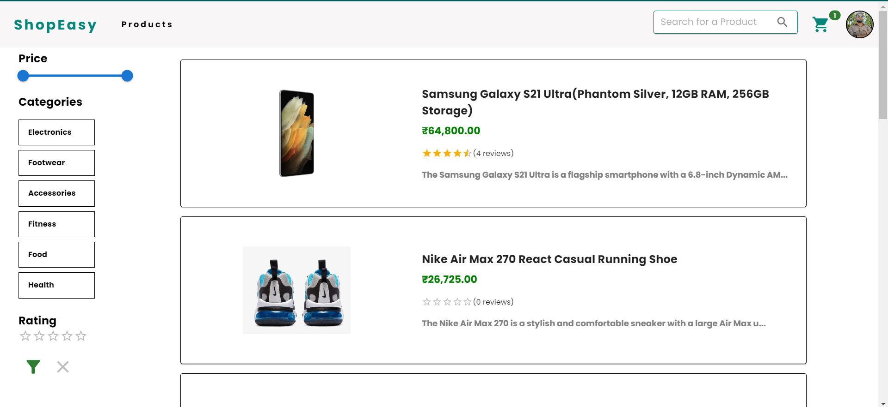
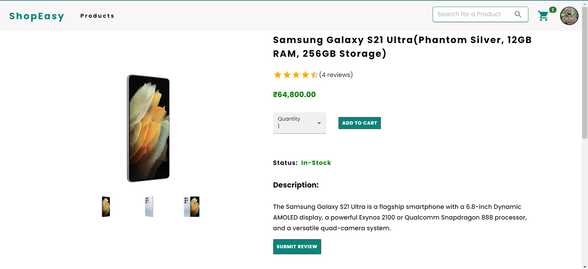
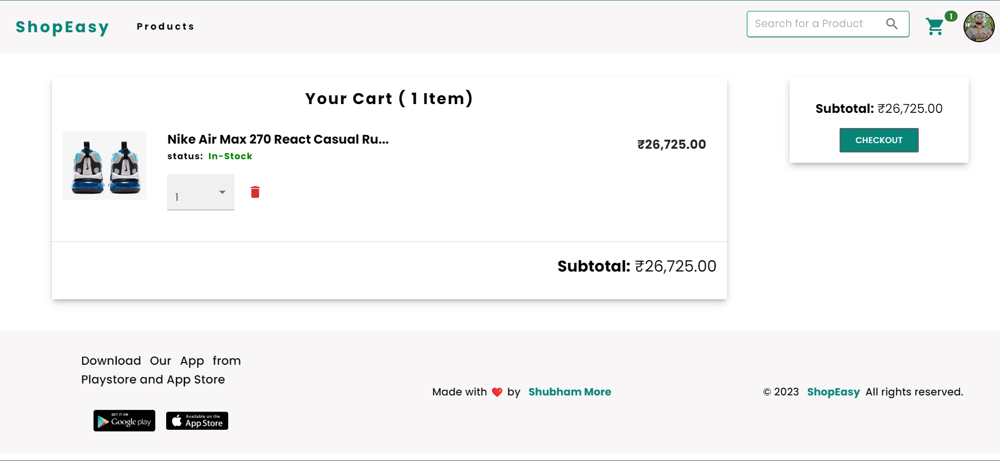
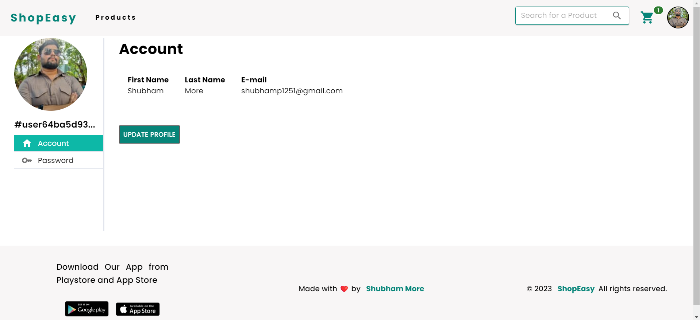
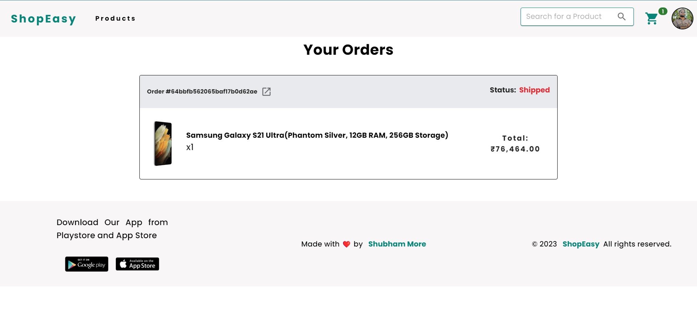
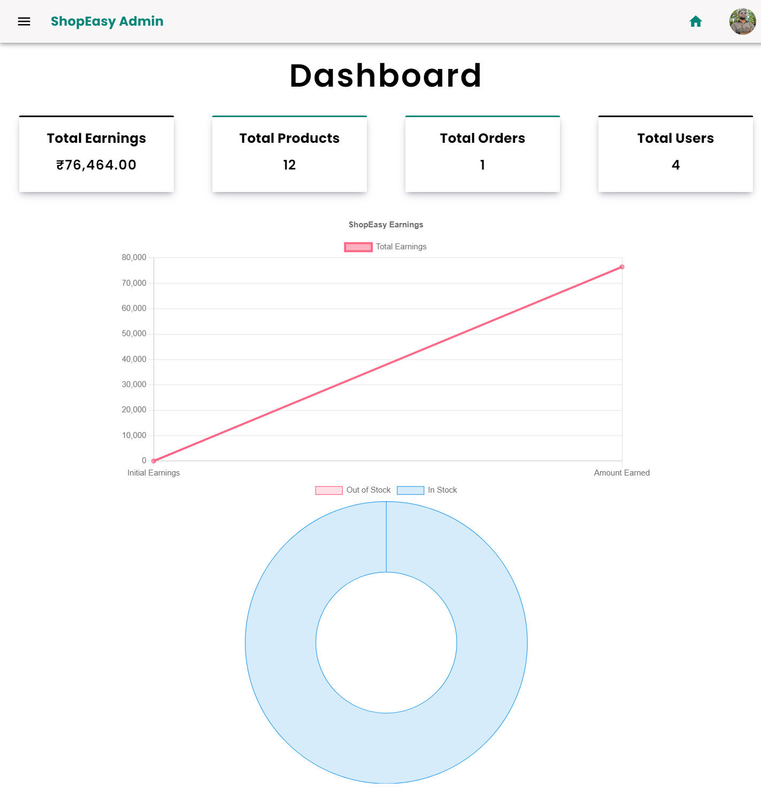

# **MERN BASED E-COMMERCE WEB APP**

## Features

- Login Register

- Forgot and Reset Password

- Search for Products

- Filter Products as per options

- Update user profile and change password

- Add Products to cart and update quyanity and delete cart

- Order Products and Watch your orders in orders section

- make payment to purchase the Product

- Can Add 2 shipping address aand save it to database

- Add review and ratings to the Product

- Admin can create, update and delete the product

- Admin can proccess the order status

- realtime product stock update

- Admin can change user role to admnin and admin to user

- Access your data on anywhere and any device

## Tech Stack

**Front-end:**

- React
- Redux
- Material UI

**Back-end:**

- Express.js

**Database:**

- MongoDB

**API Endpoints Testing:**

- Postman

**Payments:**

- Stripe

## Deployment

Front-End Hosting platform: [Netlify](https://app.netlify.com/)

Back-End Hosting platform: [Render.com](https://render.com/)

## Authors

- [@shubham-more](https://github.com/shubhammore1251/)

## Acknowledgements

- [React](https://react.dev/)
- [Material UI](https://mui.com/)
- [Express.js](https://expressjs.com/)
- [MongoDB](https://www.mongodb.com/atlas/database)
- [Stripe](https://stripe.com/in)
- [Cloudinary](https://cloudinary.com/)
- [NPM](https://www.npmjs.com/)

## Screenshots

## Support

For support, contact:

- email: shubhamp1251@gmail.com
- LinkedIn: [Shubham More](https://www.linkedin.com/in/shubham-more1251/)
